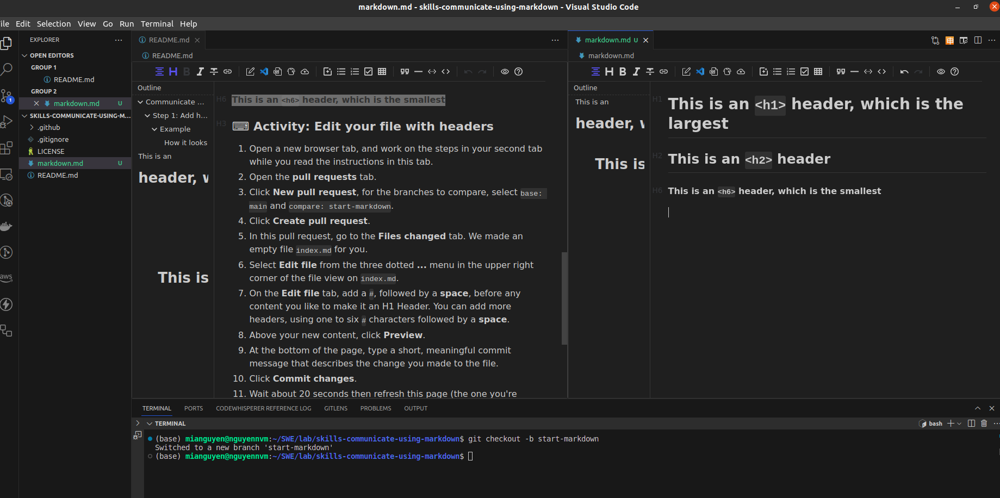

# This is an `<h1>` header, which is the largest

## This is an `<h2>` header

###### This is an `<h6>` header, which is the smallest

In this course, I will:

* [ ] Add headers
* [ ] Add an image
* [ ] Add a code example
* [ ] Make a task list
* [ ] Merge my pull request

  
